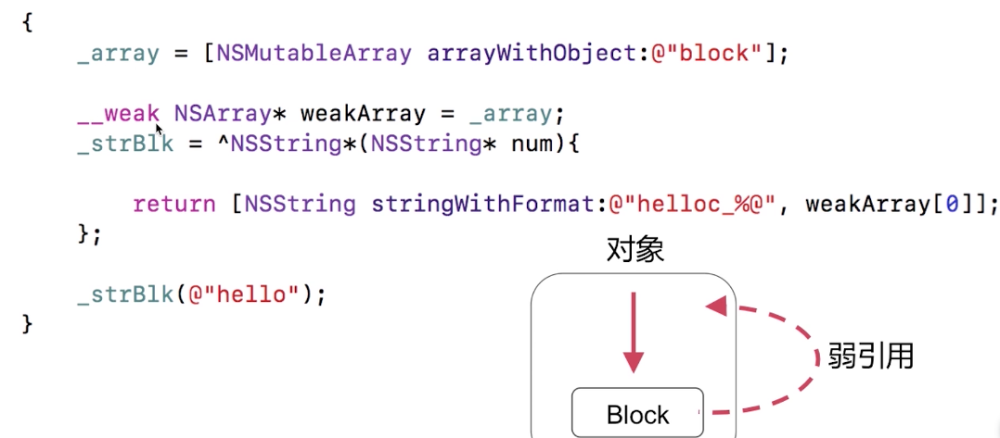
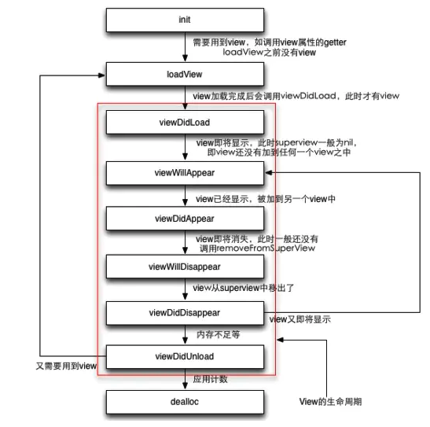
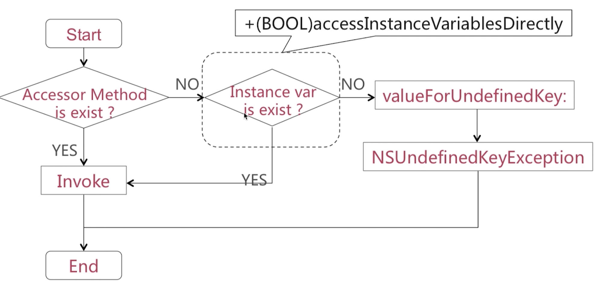
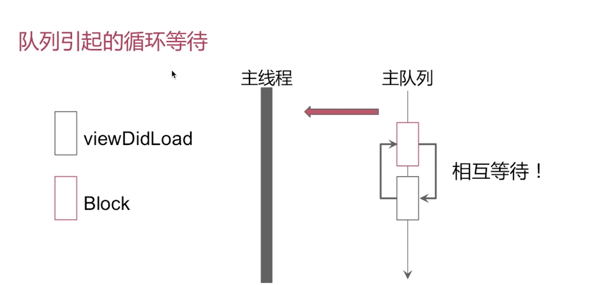
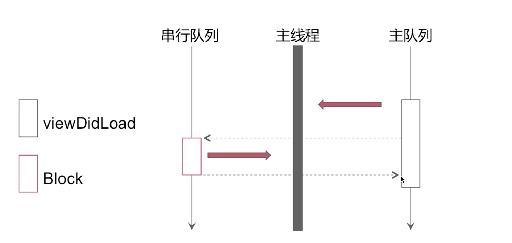
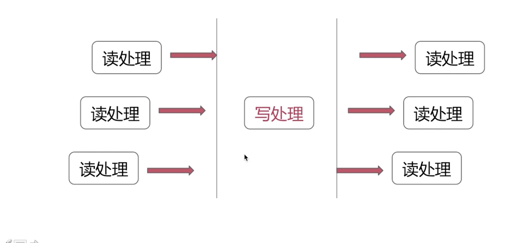
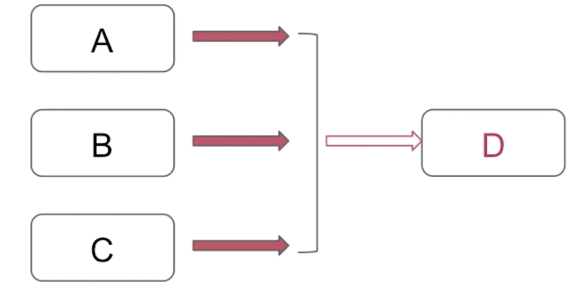

# 经典问题


### UI视图

##### 事件传递流程

`点击屏幕` → `UIWindow` → `hitTest:withEvent:`返回最终响应的视图


##### TableView Cell 重用机制

`cell = [tableView dequeueReusableCellWithIdentifier:identifer];` cell**滚出屏幕**之后会进入重用池中； 新加进来的cell可以根据指定的`identifer`标识符在回收池重用cell。达到一个复用的目的。


##### TableView数据源的同步

删除在主线程，然后后向刷新网络请求数据

* 并发访问、数据拷贝（在子线程同步删除操作）

* 串行访问

### Block


##### 怎么理解Block的？

将**函数**及其**执行上下文**封装起来的**对象**

**Block调用**就是**函数调用**


##### 如何截获变量

1. 局部变量：

   基本数据类型局部变量截获其**值**

   对象类型局部变量截获 **连同所有权修饰符（`__strong` 、`__weak`等）** 一起截获

2. 静态局部变量：指针

3. 全局变量、静态**全局变量**：不截获


##### __block修饰符

1. **一般情况**下，被截获变量进行**赋值**操作需要添加`__block`  (有点像C++引用)
2. 被修饰者变成了对象


##### 循环引用



把传入Block的对象设置成`__weak`修饰的变用weakArray，然后在Block中使用weakArray。**原因Block截获的变量是一个强引用，要把使用改成弱引用。**


### Objective-C

##### AppDelegate & ViewController生命周期

* AppDelegate

```swift
application  // 启动

applicationWillResignActive // 将进入后台
applicationDidEnterBackground  // 已经进入后台

applicationWillEnterForeground  // 将要进入前台
applicationDidBecomeActive   // 已经进入前台

applicationWillTerminate  // 终止

applicationDidReceiveMemoryWarning  // 没存不够警告
```

* ViewController




##### 单例模式实现

```objc
// A.m
+ (id)shareInstance {
    // 静态局部变量
    static A *instance = nil;
   
    // 通过dispatch_once方式，确保instance在多线程环境下只被创建一次
    static dispatch_once_t onceToken;
    dispatch_once(&onceToken, ^{
        // 创建实例
        instance = [[super allocWithZone:NULL] init];   // 不能用[self allocWithZone]第一次会循环调用
    });
    return instance;
}

// 重写方法
+ (id)allocWithZone(struct _NSZone *)zone {
    return [self sharedInstance];
}

// 重写方法: 外界有可能会调用copy方法，要保证单例唯一
- (id)copyWithZone:(nullable NSZone *)zone {
    return self;
}
```


##### 分类做了什么？

1. 声明私有方法
2. 分解类文件
3. 把Framework的私有方法公开 


##### 分来vs扩展

1. 分类运行时决议，扩展是编译时决议
2. 可以为系统类添加分类， 扩展不能给系统扩展（理解为内部私有声明）
3. 分类覆盖原方法（消息优先查找）


##### 分类可以添加哪些内容

1. 实例方法、类方法、协议、属性（只是get和set方法而已）
2. 分类可以添加**成员变量**，但是要使用关联对象


##### Delegate

代理模式（1：1）

- 对类的设计者：在类的流程中暴露出一些方法，可以放用户自定义在这个时候的操作。自定义在这个逻辑。暴露一个delegate的对象给用户，让使用者使用delegate对象实现操作。
- 设置self为delegate的接受者，然后根据需求实现delegate的方法。required必须实现。 
- 一般代理声明为**weak**规避循环引用


##### NSNotification

观察者模式（1：N）

- 定义一种一对多的关系，可以让多个观察者同时监听某一个对象或者对象的属性的变化
- 在被监听的对象在状态变化时候，会通知所有的观察者。


##### KVO

观察者设计模式实现（1：N)   Swift可以用`willSet`和`didSet` !! 实现

* 注册对象观察值（观察者observer 观察 被观察者obj的value属性，变化打印新值）

  ```objc
  // 在需要观察的地方使用
  [obj addObserver:observer forKeyPath:@"value" options:NSKeyValueObservingOptionNew context: NULL];
  
  // 在obj的类.m中MObject添加私有方法
  -(void)observerValueForKeyPath:(NSString *)keyPath ofObject:(id)objectchange:(NSDictionary<NSKeyValueChangeKey, id> *)change context:(void *)context {
      // 是否是obj这个对象
      if ([object isKindOfClass:[Mobject class]] && [keyPath isEqualToString:@"value"]) {
  
          // 获取value的新值
          NSNumber *valueNum = [change valueForKey:NSKeyValueChangeNewKey];
          NSLog(@"value is %@", valueNum)   // 获得新值
      }
  }
  ```

* `setValue:forKey:`可以用kvc设置值得使用也可以获得通知（因为调用了Setter方法）

* 通过成员变量的直接赋值是不可以获得通知的（因为没有调用Setter方法）需要手动添加KVO方法才能生效`willChangeValueForKey:` `didChangeValueForKey`


##### KVC

Key-value coding的缩写

（可以获取私有变量）所以破坏了面向对象，但是可以通过`accessInstanceVariablesDirectly`不给访问

`-(id)valueForKey:(NSString *)key`  调用有个实例的valueForKey来取和Key同名变量(或相似)的值

`-(void)setValue:(id)value forKey:(NSString *)key`设置某一个实例变量跟key同名（或相似）的值

* valueForKey

  

  * Accessor Method： 相似名字都可以获得

    `getKey`、`key`、`isKey`

    

  * Instance var:  相似名字都可获得

    `_key`、`_isKey` 、`key`、`isKey`


##### 属性关键字有哪些

* 读写权限：`readonly`、 `readwrite(默认)`

* 原子性：`nonatomic`、`atomic(默认)`

  PS：`atomic`若修饰数组，只是数组赋值能保证线程安全，修改数组中的值是不能保证线程安全的。

* 引用计数：`retain` / `strong(默认)`  ，  `unsafe_unretained`  /  `assign(默认)`

  PS : assign既可以修饰基本数据类型也可以修饰对象类型

* 其他：`weak`, `copy`

  

###### assgin vs weak

* assign修饰基本数据类型，也可以修饰对象。 weak只能修饰对象
* assign会产生悬垂指针（释放后任然指向原地址，内存泄漏和程序异常）。weak在对象释放时候会自动置成nil
* assign, weak修饰对象时候不改变引用计数。（相同点）


###### copy

浅拷贝：对内存地址的赋值。增加引用计数

深拷贝：新的内存分配（内容相同）。不增加引用计数

修饰会有`.copy`和`.mutableCopy`方法

| 源对象类型 |      拷贝方式       | 拷贝类型 |
| :--------: | :-----------------: | :------: |
|  mutable   |   copy（不可变）    |    深    |
|  mutable   | mutableCopy（可变） |    深    |
| immutable  |   copy（不可变）    |  **浅**  |
| immutable  | mutableCopy（可变） |    深    |


### 多线程

GCD、 NSOperation、NSTread （多线程与锁）

##### 同步/异步 和 串行/并发

`dispatch_sync`:立马在当前线程执行任务，执行完再往下走，这句话就可以解释很多问题。

`dispatch_async`:不要求立马在当前线程执行任务，**可能会开启新线程**，也有可能不会。

```objc
dispatch_sync(serial_queue, ^{doSomething});  // 同步串行
dispatch_sync(concurrent_queue, ^{doSomething});  // 同步并发

dispatch_async(serial_queue, ^{doSomething});  // 异步串行
dispatch_async(concurrent_queue, ^{doSomething})  // 异步并发
```

* 系统队列：`dispatch_get_main_queue`串行， `global_queue`并发

* 同步串行 问题

  ```objc
  -(void)viewDidLoad {    // 会死锁
  	dispatch_sync(dispatch_get_main_queue(), ^{
          [self doSomething];
      });
  }  
  ```

  如图，viewDidLoad在主队列中，要执行完viewDidLoad才能执行Block。但是viewDidLoad依靠Block执行完才能出队。相互等待死锁。

  

  * 更改方法：把doSomething方法放在另一个串行队列中做把`dispatch_get_main_queue`改成`serialQueue`

    

* 异步串行（最常用）

  ```objc
  -(void)viewDidLoad {
  	dispatch_async(dispatch_get_main_queue(), ^{
          [self doSomething];
      });
  }  
  ```


##### 利用GCD实现多读单写

* 读者、读者并发
* 读者和写者互斥，写者和写者互斥



使用栅栏异步调用：使用`dispatch_barrier_async`

```objc
dispatch_sync(concurrent_queue, ^{读操作});   // 并发读

dispatch_barrier_async(concurrent_queue, ^{写操作});   // 互斥写
```


##### 等任务A, B, C都执行完，在执行任务D如何实现

使用`dispatch_group_async`



现实模型：等所有图片下载完成合并成一张图片

1. 先创建一个并发队列 concurrent_queue

2. 在创建一个group。`dispatch_group_t group = dispatch_group_create()`

3. 把任务异步分派到并发队列中

   ```objc
   // 循环每一个需要做的任务
   for (NSURL *url in arrayURLs) {
       // 异步组分派到并发队列当中
       dispatch_group_async(group, concurrent_queue, ^{
           // 根据url下载图片 
       });
   }
   
   // 处理完所有图片,合成图片
   dispatch_group_notify(group, dispatch_get_main_queue(), ^{
       // 处理完所有图片会执行这个block
       // 
   });
   ```


##### iOS有那些琐

* `@synchronized`， `atomic`、`OSSpinLock`、`NSRecursivelLock`、`NSlock`、`dispatch_semaphore_t`

`@synchronized`：一般在创建单例的时候使用，保证在多线程环境下对象是唯一的

`atomic`：原子性，线程安全

`NSlock`： 临界区加锁

`dispatch_semaphore_t`： 信号量，代表有多少临街资源  `wait`减1， `singal`加1

### Swift

##### Swift vs Objective-C

1. Swift注重安全性， Objective-C灵活性
2. Swift函数式编程，面向对象等等新的编程范式。 OC几乎只有面向对象
3. Swift静态类型语言，Objective-C是动态类型语言。
4. Swift将String Array 和 Dictionary 设计成值类型， OC有点像c语言一样注重指针和索引。 
5. Swift体积会比较大


### C++

##### static

* 全局变量：保证变量只被初始化一次，在程序中只有一份内存。执行初始化分配内存后，就算函数或者代码块执行完毕，该变量也不会被回收销毁，直到程序结束 static 变量才会被回收。

* static修饰全局变量（或函数）：该全局变量（或函数）作用域为当前文件，其他外部文件无法访问，即使在外部文件中使用**extern**关键字声明也不可以。例如：使用GCD的dispatch_once创建单例时，使用static修饰全局变量sharedManager，让外界文件无法访问（工程的其他文件可以访问）。


##### extern

声明外部全局变量，即实现在没有import其他文件的情况下，也可以访问其他文件的全局变量

例如：单独抽一个类来**管理一些全局的变量或常量**，在.h文件中extern声明一些全局的常量。只要导入头文件，就可以全局的使用定义的变量或常量

```objc
//声明一些全局常量
extern NSString * const name;
extern NSInteger const count;


// 然后在.m文件中去实现：
#import <Foundation/Foundation.h>
//实现
NSString * const name = @"王五”;
NSInteger const count = 3;
```


##### const

1. const用来修饰**右边**的基本变量或指针变量
2. 被修饰的变量只读，不能被修改
3. 在一个函数声明中，const 可以修饰形参，表明它是一个输入参数，在函数内部不能改变其值；
4. 对于类的成员函数，若指定其为 const 类型，则表明其是一个常函数，不能修改类的成员变量；
5. 对于类的成员函数，有时候必须指定其返回值为 const 类型，以使得其返回值不为“左值”

用法：

```objc
//定义一个全局只读变量
NSString * const Kname = @"appkey";

//static修饰后此全局变量只能本文件访问
static NSString *const Key = @"hddjj”;
```

* **左定值，右定向** （相对在*的左边和右边）

  const在*的左边，则指针指向的变量的值不可直接通过指针改变（可以通过其他途径改变）；

  const在*的右边，则指针的指向不可变。简记为"左定值，右定向"。

  ```c++
  // 指针可以改变，指向的值不能改变
      int a=10;
      const int *p1=&a;    //例如：允许 p1+=1 ，不允许 *p1=20
      int const *p2=&a;    //这两句效果一样
  
  // 指向的值可以改变，指针不可改变
      int a=1;
      int b=2;
      int *const p3=&a;     //例如：允许 *p=3 ，不允许 p3=&b
  ```

  

