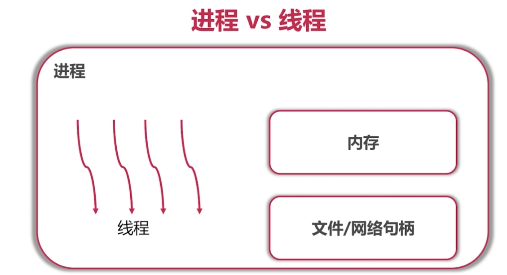
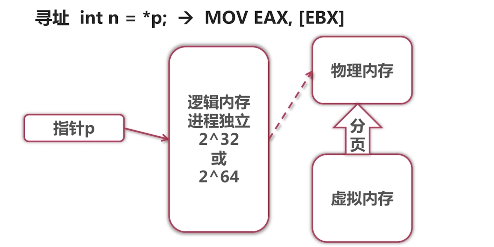

# 操作系统-问题

[进程和线程的区别好回答](https://www.zhihu.com/question/25532384/answer/81152571)

### 进程和线程的区别 

进程的间自己的内存是相互独立的， 线程共享同一个进程的内存

* 进程： 把不同的程序隔离开来

  

  1. 一个操作系统里面有可能有很多进程在运行，一个进程里面有很多线程在运行。
  2. 每个进程自己的内存（逻辑内存）是**相互独立**的。 （所以需要进程通信）
  3. 文件句柄和网络句柄，（句柄为handle）所有的进程所共有的，所有进程可以打开同一个文件，或者抢同一个网络的端口。

* 线程： **可以理解为进程是线程的一个容器，真正运行的是线程**

  

  1. 每个**函数调用**以及**局部变量**放在栈中。
  2. PC指向的是一个当前的指令（放在内存）
  3. TLS（Thread Local Storey）：系统提供内存来存放变量，这些数据是线程独有的数据。

### 简要说说寻址的过程

操作系统的存储层次： 硬盘→内存→缓存→寄存器

寻址空间：每个进程有自己的寻址空间（32位操作系统$2^{32}$ - 4G内存）（64位操作系统 $2^{64}$ - $10^{19}$Bytes）

* 指针p指的是逻辑内存（进程独立的），跟操作系统的位数有关系
* 逻辑内存 映射到 物理内存，如果在物理内存直接取得数据， 若不在物理内存就虚拟内存（在硬盘中对应分页赋值到物理内存中），通过页面置换算法（FIFO、LRU等）置换到物理内存，然后在物理内存中取出数据。

### 32位操作系统和64位操作系统区别是什么

进程寻址空间大小的区别。

32位操作系统$2^{32}$ - 4G内存

64位操作系统 $2^{64}$ - $10^{19}$Bytes

### 进程间通信机制

* **Socket**：  中文名套接字（ip + 端口号） ！！！！！！

  在机子上开一个端口作为一个服务器让客户端来连接访问。通过网络传输。TCP，UDP等等。

  浏览器跟远端服务器的进程进行通信。**只有该方法可以让不同机子的进程通信**

* **Signal**： 

  Linux常用，一个进程给另一个进程发信号

  `ps`看到所有正在运行进程的指令

  开一个进程，`kill -9 [pid]` 杀死对应pid的进程，可以告诉pid进程关掉。`-2`为键盘中断

* **管道**

  `cat test.txt | grep -e "ERROR" --color ` 把cat的结果通过管道到另一个进程去高亮test.txt输出出现的"ERROR"。 

* **文件**： 

  一个进程写文件，另外一个进程打开文件就可以通信

* **同步机制**，如信号量，互斥操作。注意信号量跟Signal不是同一个东西。

* **消息队列**：一个进程可以向另外一个进程发消息，很多进程都可以听这个消息队列。

* **共享内存**：操作系统有一个机制，若操作系统都同意共享这个内存，可以通过访问同一个内存进行通信

### 简要说一下中断的概念和流程

中断使系统停止当前进程而转而执行其他进程，或缺少某种资源等待操作系统资源到达，在系统忙完其他事情后继续执行。

流程：陷入OS，保护现场，根据功能号查入口地址，跳转具体处理程序