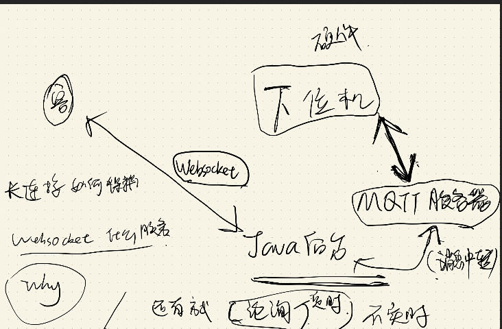
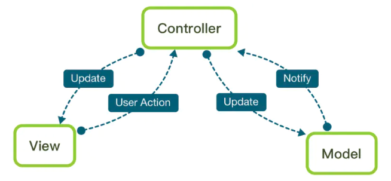
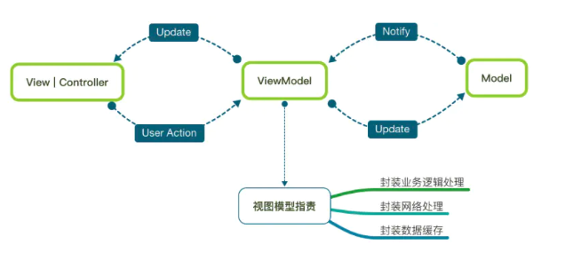
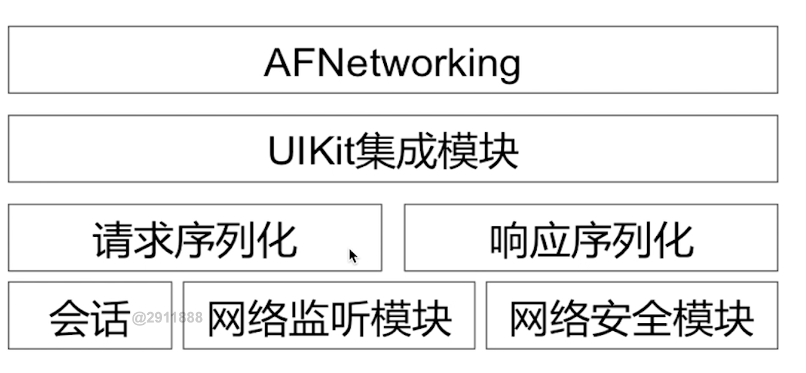

# 简历问题

很高兴能才参加这轮面试，我叫吴宇轩，目前就读于华南理工大学软件工程专业。在研究生期间都做过一些移动端的开发，参与过一些实验室的校企研究项目。还有一个受理的发明专利。这次实习是想找有关iOS相关的实习。做过一个上架的iOS项目，名字为智能厕所，可以查看一些各地厕所的的气体水电表以及设备信息，以及设定些远程厕所参数和控制厕所的开关。还有一个是有关使用ARKit的AR项目，可以制作出的商品AR模型,通过相机投射到物理空间，对模型进行一些手势交互，现实测距。主要使用语言Swift和OC。具有阅读英语文档的能力，以及会用版本控制工具（git）。对移动端开发比较感兴趣，希望春招能找到实习来，接触一线大厂的开发经验，也能为公司乃至社会尽微薄之力吧。

奖项： 本科创新创业工作室 营养餐厅（跟天津市的望海餐厅合作的） 一个点餐的App。是一个针对平板的一个项目

Swift 和 Objective-C的区别？

1. Swift注重安全性， Objective-C灵活性
2. Swift函数式编程，面向对象等等新的编程范式。 OC几乎只有面向对象
3. Swift静态类型语言，Objective-C是动态类型语言。
4. Swift将String Array 和 Dictionary 设计成值类型， OC有点像c语言一样注重指针和索引。 
5. Swift体积会比较大

## 智能厕所

### 项目介绍

该项目是叫智能厕所，是实验室的一个校企合作的一个项目。可以使用Web和移动端查看每个厕所的信息（基本的水电，人流量，气体检测（NH3 H2S））。 还可以进行 远程控制（开关 厕所灯 抽风机 音乐 消毒 风幕机 冲洗 设备是不是异常） 门口的监控摄像头 （设定一些厕所的参数（定时器））。我的工作就是负责根据通信协议通过WebSocket进行对厕所的连接，以及控制，以及一些可视化工作。这个项目已经上架App可以下载

##### 架构

##### WebSocket

WebSocket：WebSocket是一种HTML5的协议，是位于应用层的协议用于对数据的包装解析。

Socket是位于传输层和应用层之间的抽象接口，主要是用于方便对TCP/IP协议等使用（HTTP和Socket什么关系，WebSocket和Socket就是什么关系）

长连接：心跳机制  

此选项表示每隔多久轮循一次，单位为秒。每次检测时遍历所有连接，如果某个连接在间隔时间内没有数据发送，则强制关闭连接（会有onClose回调）。

iOS框架： `SocketRocket`

##### MVC & MVVM

MVC和MVVM：目的都是分离Model与View，但是MVVM更好的将表示逻辑分离出来，减轻了Controller的负担；

* MVC: 实现View与model分离通过Controller

  

* MVVM: API请求完数据，解析成Model，之后在ViewModel中转化成能够直接被视图层使用的数据，交付给前端（View层）

  

  

##### AutoLayout 

  autoLayout： 后来使用Masory框架, 适配了iPhoneX的刘海屏. 基于约束，把约束变成方程组，计算出一个合理的Frame，进行布局。可以动态的适配。VFL（描述性语言,语法糖）用字符串来表现约束条件` [button1] - 5 - [button2]`   

  代码比较好追踪。 Storyboard可视化：多人合作不好跟踪。 （Frame适应布局）

  适配iPhoneX: safeAreaLayoutGuide。 取屏幕大小，判断机型，定义特殊的status bar的高度，若是刘海就是**44**， 不是刘海就是**20**。

## AR项目

### 项目介绍

该项目是叫AR商品的投射和行为采集，是广州市科技厅跟实验室合作的项目。我负责的是iOS端，主要完成了AR模型构建和预览，AR模型的放置，交互以及测距等，并把交互信息上报给Server。去年3月份跟实验室几个同学花了2个月时间做得，项目有iOS和安卓前端以及前段可视化和后台。其中iOS端是我独立开发的，也是我第一个iOS项目。主要使用的技术是ARKit，语言是Swift。然后我还根据这个项目，获得受理专利通过深度学习来对用户的对AR模型的交互信息来对用户购买率进行预测。

##### SceneKit

SceneKit 用来建立虚拟世界

##### ARKit

1. 维持世界追踪。指的是当你移动摄像头，要去获取新的现实世界的信息。

2. 进行场景解析。指的是解析现实世界中有无特征点、平面等关键信息。

3. 处理与虚拟世界的互动。指的是当用户点击或拖动屏幕时，处理有没有点击到虚拟物体或者要不要进行添加/删除物体的操作。

ARSession 包括空间计算、利用手机传感器和现实空间进行拟合操作

ARSessionConfiguration： 用于配置ARSession的交互（是否进行垂直或者是平面。还有其他的配置在官方文档都有很详细得提到）

ARSCNVIew： 将模型展现

Anchor： 用来识别显示空间的锚点的。

一些博客，查看官方文档。

还有android 版本： Google提出。 效果没有苹果ARKit的好

为什么收集序列，有什么用？ 跟广州省科技厅的一个项目，用户对这个AR模型的操作序列，移动-换颜色-打开门-旋转-平移等等。 我们想这么做的原因是想挖掘出用户操作AR商品的序列跟购买率有什么关系？ （结合评分个性化推荐）

## NewApp

### 项目介绍

根据网课开发的一个新闻类App，熟悉了一些基本的套路

##### AFNetworking

核心类： AFURLSessionManager。 

* 创建管理系统的NSURLSession、NSURLSessionTask
* 时间NSURLSessionDelegate等协议的代理方法，处理一些网络响应
* 引入AFSecurityPolicy保证请求的安全。 比如在https中一些证书的校验

##### SDWebImage

异步下载图片并且支持缓存的框架

架构图？ 

SDWebImageManager： 异步下载器

SDImageCache ： 缓存由SDImageCache类来实现，这是一个单例类，该类负责处理内存缓存及一个可选的磁盘缓存，其中磁盘缓存的写操作是异步的，这样就不会对UI操作造成影响。

加载图片流程？

（缓存）查找内存缓存 → 查找磁盘缓存 → 网络下载

##### AVPlayer

在 AVFoundation类

使用AVPlayer播放流程？

1. 根据资源地址URL，创建AVPlayerItem
2. 根据AVPlayerItem创建播放器
3. 获取播放器中的Layer，粘贴到自己想要的位置 （layer就是视频）
4. 播放以及基本开始和暂停

广播形式进行传播，系统发事件，监听事件。 通知（一个单例NSNotificationCenter,是在类声明周期dealloc的时候销毁）。监听播放完的的时候就把视频移除。

播放进度： CMTime 秒， CMTimeMake帧率几帧/s. 系统的一个Block回调

进度条：播放到60   seekToTime  播放进度的回调， 到哪个时间

单例： 管理。App同时只能够播放一个视频？

设置一个静态类 +(GTVideoPlayer *)Player, 然后使用gcd当中dispatch_once_t实现一个单例。

