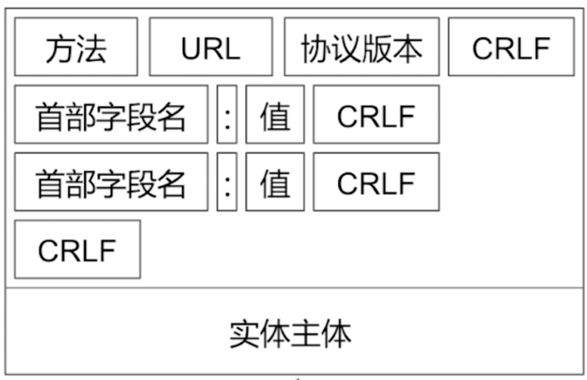
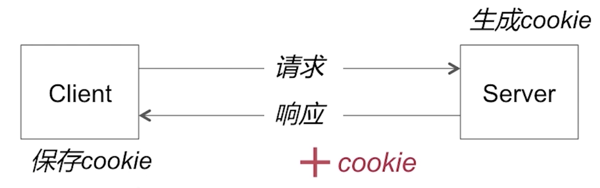
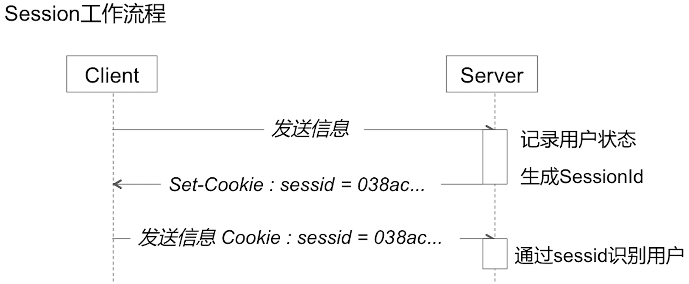
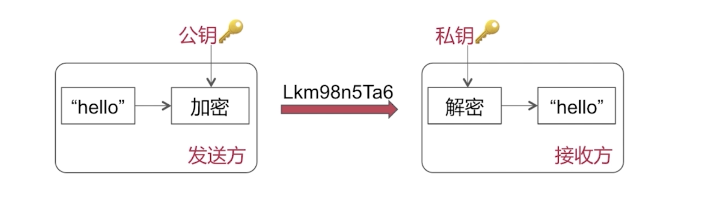

# HTTP & HTTPS

应用层协议

## HTTP 

名字：超文本传输协议（**H**yper**t**ext **T**ransfer **P**rotocol）

### 请求 / 响应报文

#### 请求

Client → Server 

* HTTP的请求方式：`get`、 `post`、 `head`、 `put`、 `delete`、 `options`

* 请求报文格式：`post`（有实体主体） `get`（没有实体主体）

  

* `get`和`post`请求方式

  * 使用：

    1. get请求参数以`?`号分隔拼接到URL后面；post请求参数在Body里面。
    2. get长度是有限制的2048个字符；post一般没有限制。
    3. get请求不安全；post请求比较安全。

  * **语义**的角度：

    get是获取资源（安全的，幂等的，可缓存的）；post是处理资源（非安全，非幂等的，不可缓存）

    1. 安全性： 不应该引起Server端的任何状态变化。 
    2. 幂等性：请求一个请求方法**执行多次和执行一次**的效果完全相同。
    3. 可缓存性：请求是否可以被缓存。（官方规范，代理服务器可以进行缓存结果）

#### 响应

Server → Client

* 响应报文格式

  

* 状态码的含义

  * 常见的状态码：

    `100`Sever端已接受受请求，但客户端还要继续请求。

    `200`响应成功

    `301/302`网络重定向

    `401/404`Client端发送的请求有问题

    `501/502`Sever端有异常。

### 连接 （建立 & 释放） 流程

如图：一共分成3个步骤： 1. 三次握手（TCP）。2. http请求和响应。3.四次挥手（TCP）。

#### 第一步：三次握手：

1. Client先发起**SYN请求报文**给Server
2. Server端返回给Client一个**SYN的确认报文**和**ACK的请求报文**
3. 最后再有Client发给Server**ACK确认报文**

#### 第二步：http请求和响应：

Client发送http请求报文给Server；Server返回给Client响应报文

#### 第三步：四次挥手：

1. Client发送**FIN终止报文**给Server
2. Server返回**ACK终止确认报文**给Client （半关闭状态）
3. **经过某个时间**，再由Server发送**FIN终止报文**和**ACK确认报文**给Client
4. Client回给Server一个ACK确认终止报文（Server收到之后断开连接）
5. Client等待2*MSL后断开连接

### 特点

#### 无连接

每次发送请求需要建立连接和释放连接这样一个过程，是无连接状态的。

HTTP的非持久连接：每次发送网络http请求都是要重新创建TCP连接和销毁（三次握手、四次挥手）

HTTP的持久连接：只要经历一次TCP连接和销毁（多个http请求可能在同一个TCP链路上传输，可以减少重新连接的开销）

* 持久连接

  1. 头部字段：

     * `Connection ：keep-alive` （Client期许采用持久连接）

     * `time：20`（TCP连接持续多长时间，单位s，若20s内同一个域名/ip可以复用曾经的TCP连接）
     * `max:：10`（这条TCP连接最多可以发生10条http请求和响应对）

  2. 判断一个请求是否结束：

     * `Content-length`：1024（在返回**响应报文**中，Sever会规定一个响应数据的数据大小，通过Content-length来标识。Client可以查看是否达到这个长度来判断是否接收完成，单位字节）
     * `chunked`（Server返回的**响应报文**中，有chunked字段，若为空代表结束了，不为空就说明还有数据要返回给Client，一般post后返回响应报文的时候用）

* Charles抓包原理（http的中间人攻击）：当Client发送http请求的时候，经由**中间人（Charles）**hold住并假冒Client身份请求Server，然后Server返回结果给中间人，再由中间人返回给客户端。（中间人可以篡改数据）

  

#### 无状态

无状态：一个用户多次发送同一个请求的时候，Server是不知道是同一个用户的。

Cookie / Session可以对其无状态的特性做出补偿，让其逻辑变成有状态

* Cookie： 主要用来记录用户状态，区分用户；**状态保存在客户端**

  * 在http set Cookie这个字段中
  * 修改Cookie： 新值覆盖旧值（但是字段需要一样）， 或者设置一个过期时间让Cookie过期
  * 保证Cookie安全：1. 加密。 2.只在https上携带Cookie。3.设置httpOnly，防止跨站脚本攻击

* Session：用来记录用户状态，区分用户；**状态存放在服务器端**

  * 工作流程：在Server生成记录用户状态的SessionId发给Client，Server发送请求时带上SessionId让Server识别是哪个用户

    

## HTTPS

名字：超文本传输**安全**协议（Hyper Text Transfer Protocol over SecureSocket Layer）

### 跟HTTP的区别

HTTPS = HTTP + **SSL / TLS**，

SSL / TLS 在**传输层之上，应用层之下**

添加了一个中间的安全层来为网络安全的机制。（**SSL / TLS 在传输层之上，应用层之下**）

### 连接 （建立 & 释放） 流程

* 会话秘钥：由random S + random C + 预主密钥组成。 构成**对称加密**的会话结果
* 流程：
  1. Client发给Server一个支持的加密算法列表，包括TLS的版本号和一个随机数C
  2. Server回给Client一个证书以及商定的加密算法，和一个随机数S
  3. 通过非对称加密，对`对称秘钥`传输
  4. 让非对称加密保护的`对称秘钥`进行网络的访问和数据的传输

### 加密手段

主要有非对称加密和对称加密。

* 连接**建立过程**使用**非对称加密**（比较**耗时**）

* 后续的通信过程使用**对称加密**

#### 非对称加密

加密用公钥，解密就用私钥， 反之同理（加密用私钥，解密就用公钥）

#### 对称加密

加密解密用同一把钥匙。

缺点：秘钥在网络中进行传递，有可能遭遇中间人攻击（对秘钥进行劫持），安全较非对称弱

