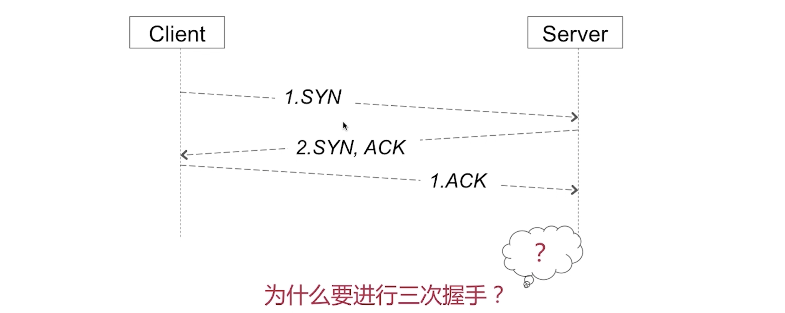
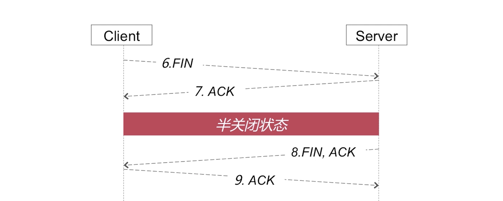
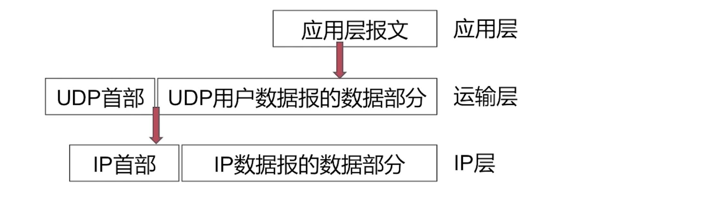
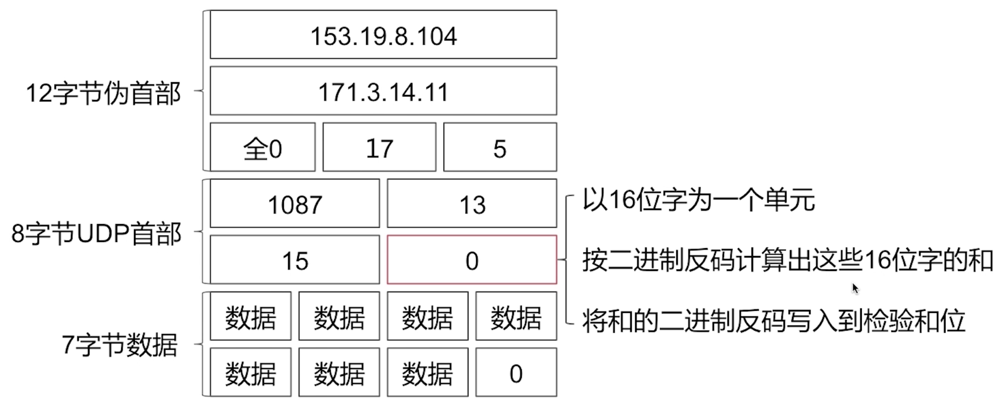

# 1. HTTP & HTTPS

应用层协议

HTTP2.0

* 二进制编码

* 多路复用

## HTTP 

名字：超文本传输协议（**H**yper**t**ext **T**ransfer **P**rotocol）

### 请求 / 响应报文

#### 请求

Client → Server 

* HTTP的请求方式：`get`、 `post`、 `head`、 `put`、 `delete`、 `options`

* 请求报文格式：`post`（有实体主体） `get`（没有实体主体）

  

* `get`和`post`请求方式

  * 使用：

    1. get请求参数以`?`号分隔拼接到URL后面；post请求参数在Body里面。
    2. get长度是有限制的2048个字符；post一般没有限制。
    3. get请求不安全；post请求比较安全。

  * **语义**的角度：

    get是获取资源（安全的，幂等的，可缓存的）；post是处理资源（非安全，非幂等的，不可缓存）

    1. 安全性： 不应该引起Server端的任何状态变化。 
    2. 幂等性：请求一个请求方法**执行多次和执行一次**的效果完全相同。
    3. 可缓存性：请求是否可以被缓存。（官方规范，代理服务器可以进行缓存结果）

#### 响应

Server → Client

* 响应报文格式

  

* 状态码的含义

  * 常见的状态码：

    `100`Sever端已接受受请求，但客户端还要继续请求。

    `200`响应成功

    `301/302`网络重定向

    `401/404`Client端发送的请求有问题

    `501/502`Sever端有异常。

### 连接/释放

如图：一共分成3个步骤： 1. 三次握手（TCP）。2. http请求和响应。3.四次挥手（TCP）。

#### 1. 三次握手

1. Client先发起**SYN请求报文**给Server
2. Server端返回给Client一个**SYN的同步报文**和**ACK的确认报文**
3. 最后再有Client发给Server**ACK确认报文**

#### 2. http请求和响应

Client发送http请求报文给Server；Server返回给Client响应报文

#### 3. 四次挥手

1. Client发送**FIN终止报文**给Server
2. Server返回**ACK终止确认报文**给Client （半关闭状态）
3. **经过某个时间**，再由Server发送**FIN终止报文**和**ACK确认报文**给Client
4. Client回给Server一个ACK确认终止报文（Server收到之后断开连接）
5. Client等待2*MSL后断开连接

### 特点

#### 无连接

每次发送请求需要建立连接和释放连接这样一个过程，是无连接状态的。

HTTP的非持久连接：每次发送网络http请求都是要重新创建TCP连接和销毁（三次握手、四次挥手）

HTTP的持久连接：只要经历一次TCP连接和销毁（多个http请求可能在同一个TCP链路上传输，可以减少重新连接的开销）

##### 持久连接

1. 头部字段：

   * `Connection ：keep-alive` （Client期许采用持久连接）

     HTTP/1.1 中，`Connection: keep-alive` 是默认启用的，表示持久连接，以便处理不久后到来的新请求，无需重新建立连接而增加慢启动开销，提高网络的吞吐能力

   * `time：20`（TCP连接持续多长时间，单位s，若20s内同一个域名/ip可以复用曾经的TCP连接）

   * `max:：10`（这条TCP连接最多可以发生10条http请求和响应对）

2. 判断一个请求是否结束：

   * `Content-length`：1024（在返回**响应报文**中，Sever会规定一个响应数据的数据大小，通过Content-length来标识。Client可以查看是否达到这个长度来判断是否接收完成，单位字节）
   * `chunked`（Server返回的**响应报文**中，有chunked字段，若为空代表结束了，不为空就说明还有数据要返回给Client，一般post后返回响应报文的时候用）

##### 中间人攻击

**Charles抓包原理**（http的中间人攻击）：当Client发送http请求的时候，经由**中间人（Charles）**hold住并假冒Client身份请求Server，然后Server返回结果给中间人，再由中间人返回给客户端。（中间人可以篡改数据）

#### 无状态

无状态：一个用户多次发送同一个请求的时候，Server是不知道是同一个用户的。

##### Cookie / Session

Cookie / Session可以对其无状态的特性做出补偿，让其逻辑变成有状态

* Cookie： 主要用来记录用户状态，区分用户；**状态保存在客户端**

  * 在http set Cookie这个字段中
  * 修改Cookie： 新值覆盖旧值（但是字段需要一样）， 或者设置一个过期时间让Cookie过期
  * 保证Cookie安全：1. 加密。 2.只在https上携带Cookie。3.设置httpOnly，防止跨站脚本攻击

* Session：用来记录用户状态，区分用户；**状态存放在服务器端**

  * 工作流程：在Server生成记录用户状态的SessionId发给Client，Server发送请求时带上SessionId让Server识别是哪个用户

    

## HTTPS

名字：超文本传输**安全**协议（Hyper Text Transfer Protocol over SecureSocket Layer）

### 跟HTTP的区别

HTTPS = HTTP + **SSL / TLS**，

SSL / TLS 在**传输层之上，应用层之下**

添加了一个中间的安全层来为网络安全的机制。（**SSL / TLS 在传输层之上，应用层之下**）

### 连接 / 释放

* 会话秘钥：由random S + random C + 预主密钥组成。 构成**对称加密**的会话结果
* 流程：
  1. Client发给Server一个支持的加密算法列表，包括TLS的版本号和一个随机数C
  2. Server回给Client一个证书以及商定的加密算法（DH 算法， RSA），和一个随机数S
  3. 通过非对称加密，对`对称秘钥`传输
  4. 让非对称加密保护的`对称秘钥`进行网络的访问和数据的传输

### 加密手段

主要有非对称加密和对称加密。

* 连接**建立过程**使用**非对称加密**（比较**耗时**）

* 后续的通信过程使用**对称加密**

#### 非对称加密

加密用公钥，解密就用私钥， 反之同理（加密用私钥，解密就用公钥）

#### 对称加密

加密解密用同一把钥匙。

缺点：秘钥在网络中进行传递，有可能遭遇中间人攻击（对秘钥进行劫持），安全较非对称弱

# 2. TCP & UDP

传输层协议

## TCP

名称：传输控制协议（Transmission Control Protocol）

### 特点

面向连接、可靠传输、面向字节流、流量控制、拥塞控制

#### 面向连接

TCP是**全双工通信**（数据双向）。可以理解为：没有客户端和服务端之分，只有发起方和接收方，双方都可以发起三次握手和四次挥手。

##### 三次握手

* 数据传输开始前，需要建立连接（三次握手）

  

  * 过程：
    1. Client先发起**SYN请求报文**给Server
    2. Server端返回给Client一个**SYN的确认报文**和**ACK的请求报文**
    3. 最后再有Client发给Server**ACK确认报文**。

  * 详解为什么需要三次握手而不是两次？

    答：若Client端发送的SYN1同步报文发生了**超时**（在网络中逗留了），Client没有收到Server的回应，所以开始**超时重传**，发送了第二个SYN2同步报文。Server收到了报文，回应ACK给Client，并成功建立连接（两次握手结束）。**而这个时候，发生超时的同步报文SYN1，才送达到Server中，就认为Client端又要建立一个，而 Server又发送了ACK给Client**（Server的视角看，认为Client建立了两个连接，其实是一次连接）。 三次握手就可以解决这个问题，Client发送一个ACK报文给Server确认连接，Server才认为客户端建立了建立。而超时的SYN是不会受到Client的回复ACK的，因为Client已经建立了连接，所以Server是不会收到第二个ACK的，从而Server认为这是一个超时的同步报文。还有一种情况是发生死锁。

##### 四次挥手

* 数据传输结束后，需要释放连接（四次挥手）
  
  
  * 过程：（接受者先断开）
    1. Client发送**FIN终止报文**给Server
    2. Server返回**ACK终止确认报文**给Client （半关闭状态）
    3. **经过某个时间**，再由Server发送**FIN终止报文**和**ACK确认报文**给Client
    4. Client回给Server一个ACK确认终止报文（Server收到之后断开连接）
    5. **Client等待2*MSL后断开连接**
  
  * **因为基于全双工通信，需要双方都进行确认，才能保证双方都知道要关闭连接。**
  
  * MSL：报文最大生存时间。 最后发送方需要等待2 * MSL的时间才能断开连接
  
    原因：
  
    1. 若最后Client的同步关闭报文没有传到Server，务器会超时重传这个FIN-ACK，接着客户端再重传一次确认，重新启动时间等待计时器。最后客户端和服务器都能正常的关闭。**假设客户端不等待2MSL，而是在发送完ACK之后直接释放关闭，一但这个ACK丢失的话，服务器就无法正常的进入关闭连接状态。**
    2. 他还可以防止已失效的报文段。客户端在发送最后一个ACK之后，再经过经过2MSL，就可以使本链接持续时间内所产生的所有报文段都从网络中消失。从**保证在关闭连接后不会有还在网络中滞留的报文段去骚扰服务器**。

#### 可靠传输

##### 重传机制

* 通过重传机制保证可靠传输（**无差错，不丢失，不重复，按序到达**）
  * TCP每发送一个报文，就对报文段设置一个定时器，规定时间没有收到确认，就会重传该报文。

##### 停止等待协议

* **停止等待协议**（每发送完一个分组就停止发送，等待对方的确认。在收到确认后再发送下一个分组）

#### 面向字节流

跟UDP做尽最大努力交付不同，TCP是以字节为传输单位，无论报文的大小多大，都会拆成字节流的形式再编序号号传输，**每一个字节对应一个序号**。超过MSS时，TCP就会对数据进行分段

#### 流量控制！

1. 如果发送方把数据发送得过快，接受方可能就来不及接受了，就会造成数据的丢失。流量控制让发送方速率不要太快，既要让接受方来得及接受，也不要网络拥塞。 **滑动窗口协议**可以实现流量控制。（因为TCP是面向字节流的，传输以字节为单位，以序号编号）
2. 流量控制要做的就是抑制发送端的发送速率，以便使接收端来得及接收（**点对点**）。

##### 滑动窗口协议

* 滑动窗口协议

  
  
  * 上图接受窗口中的序号不一定有序，因为有可能中途丢包了，发送方会重传
  
  * 下图例子模拟滑动窗口的过程：
  
    1. 发送方：通过seq表示字节流序号（对应已发送），DATA是数据。
    2. 接收方：返回的ACK为确认报文， ack为收到的最后序号（按序到达的结尾），rwnd发送方还能发多少字节（接收窗口还剩多少）。
  
    

#### 拥塞控制！

在某一段时间，网络中 ：  对资源的**需求**的总和 > 可用资源。比喻：进水管的流量流入速度 > 出水管的流量流出的速度

发送端的主机在确定发送报文段速率的时候，既要根据接收端的接收能力，又要从全局考虑不让网络发生拥塞。因此，TCP要求发送端维护两个窗口。

* 接收端窗口rwnd：即流量控制的滑动窗口
* 拥塞控制窗口cwnd：发送端根据自己估计的网络拥塞程度而设置的窗口值，反应网络当前容量。

所以，   **发送窗口的上限值 = Min(rwnd, cwnd)**

PS: 一般来说接收方的总是有足够大的缓存空间，因此发送窗口的大小由网络的拥塞程度来决定的，也就是说发送窗口等同于cwnd（拥塞控制窗口）

拥塞避免算法： **慢开始算法   （快重传， 快恢复）**

##### 慢开始

* 慢开始

  

  * x轴：传输轮次（一个传输轮次时间就是**一个报文段（是以但以字节流为单位）的往返时间RTT**）

    y轴：cwnd（拥塞窗口大小）

    网络拥塞含义：网络出现超时了，表明拥塞

  * 算法原理：

    * 额外维护一个状态变量**门限**值ssthresh。

    1. 当`cwnd < ssthresh`, 使用慢开始（cwnd指数增大）
    2. 当`cwnd > ssthresh`, 停止使用慢开始，改用拥塞避免算法（cwnd线性增大）
    3. 当`cwnd == ssthresh`,既可以使用慢开始，也可以使用拥塞避免
    4. 网络拥塞后（超时），使`ssthresh = cwnd / 2`（乘法减小），使得门限值减小到开始拥塞时窗口的一半。 再使`cwnd = 1`， 让窗口从头开始，增加慢开始。 
    5. 以此类推...

##### 快重传

* 快重传

  接受方没收到一个失序的报文段后立即发出重复确认。发送方只要收到3个重复确认就立即传给对方尚未收到的报文段。

##### 快恢复

* 快恢复

  由于发送方认为网络可能没有发生拥塞。更改了慢开始的第四步 “网络拥塞后（超时），使`ssthresh = cwnd / 2`（乘法减小），使得门限值减小到开始拥塞时窗口的一半。”，后不让`cwnd = 1`使用慢开始算法，而是`cwnd /= 2`使用拥塞避免算法。

## UDP

名称：用户数据报协议（User Datagram Protocol）

### 特点

无连接、不可靠（尽最大努力交付）、面向报文。

#### 无连接

不需要建立连接，即不需要三次握手

#### 不可靠

（尽最大努力交付）

不保证可靠传输（把应用程序传给IP层的数据发送出去，并不保证他们能到达目的地）

#### 面向报文

既不合并，也不拆分。（报文大了不合并，小了也不拆分）

**应用层的报文**原封不动的作为**传输层的数据部分**（加上UDP首部），以此类推到iP层，总之以报文为最小单位。

### 功能

功能有复用、分用、差错检验 （只是传输层的基本功能）

套接字概念解释：ip号 + 端口号（一般ip对应一个客户端，端口对应一个应用）

#### 复用

* 建立传输的过程中需要套接字（ip+端口），无论哪个端口都可以**复用**传输层的数据报，再经由ip层传输。

#### 分用

* 从ip层接受了ip数据报数据，然后拆成UDP数据报。每一个数据报文格式中有源端口和目的端口标识，根据目的端口进行**分发**数据给不同的端口。

#### 差错检验

* 每一行是32个bit 也就是4个字节（1字节 = 8位）。
* 前12个字节是伪首部，用来进行**差错检测**，拼接在UDP数据报前中。
* 把前12个校验位**做运算**（以16位为一个单位，按其反码算出16，将和写入位于UDP首部字段的**校验和位**）
* **接受方收到该UDP报文的时候，通过上述的运算，算出是否是等于该校验位的和。**一样就表示没有差错。

比如在IM通讯软件发消息的时候如何验证是不是正确的消息。（利用了差错检测的思路和策略）

